# Benchmarks et optimisation générale

disclaimer: les tests d'input lag ont été réalisé avec AMD FLM (ce n'est pas forcement le plus opti mais reste une bonne référence)

[TOC]

## Avant opti

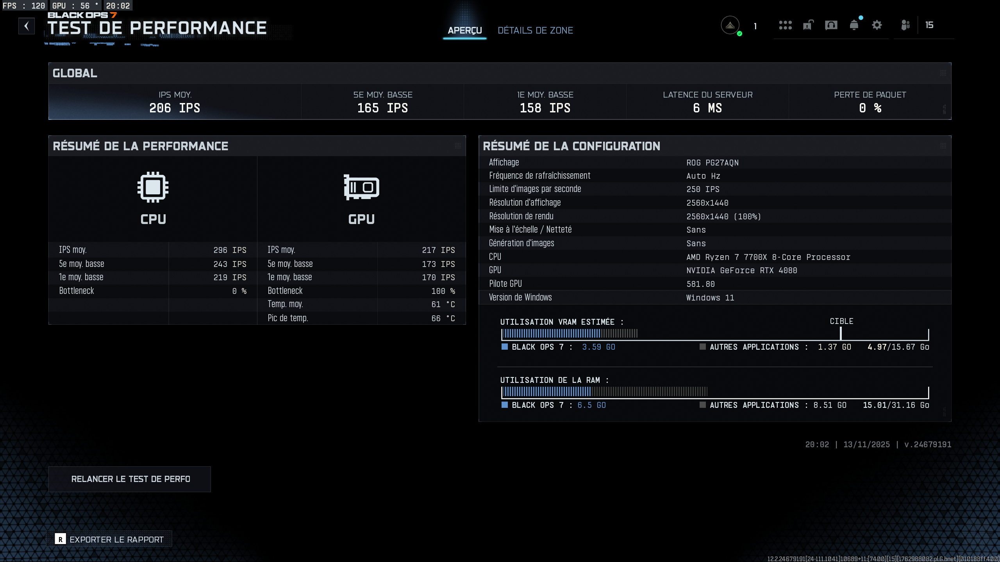
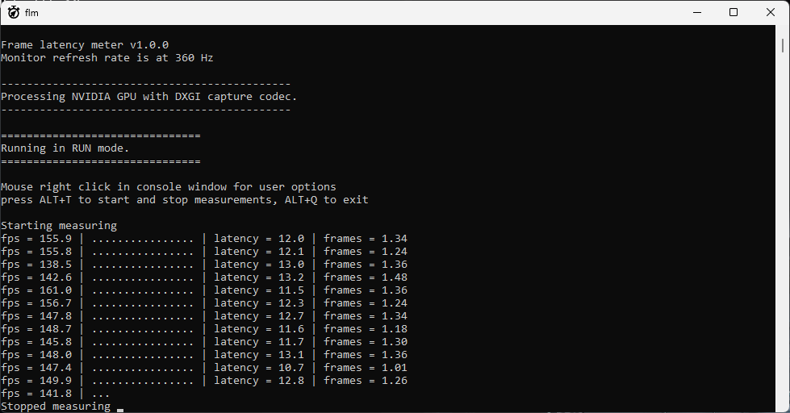

### Test pur natif

p.s. la qualité du rendu n'est pas au rdv pour un FPS

## Opti

### Panel Nvidia pour activer G-SYNC

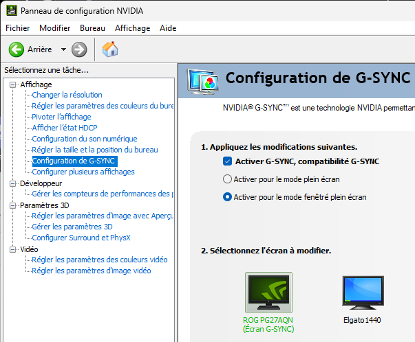

### Panel Nvidia

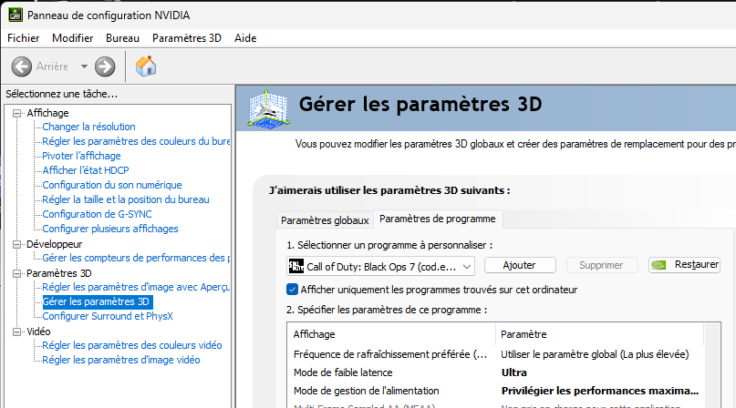

### Lancer le script d'opti

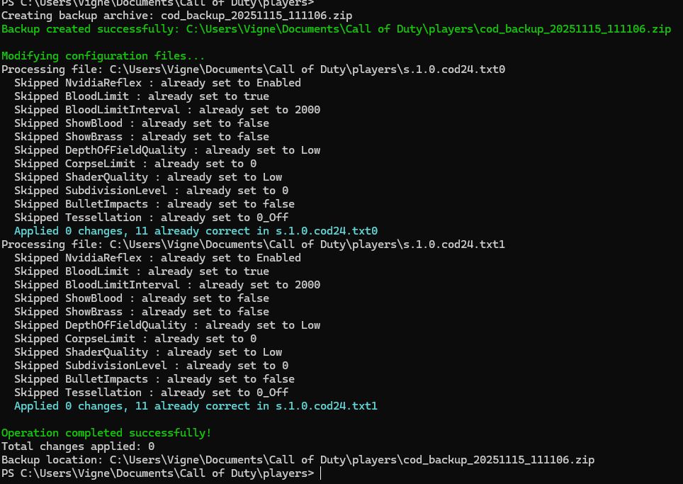

### 1er test : pas de G-SYNC / V-SYNC avec Nvidia Reflex "Activé + Boost"

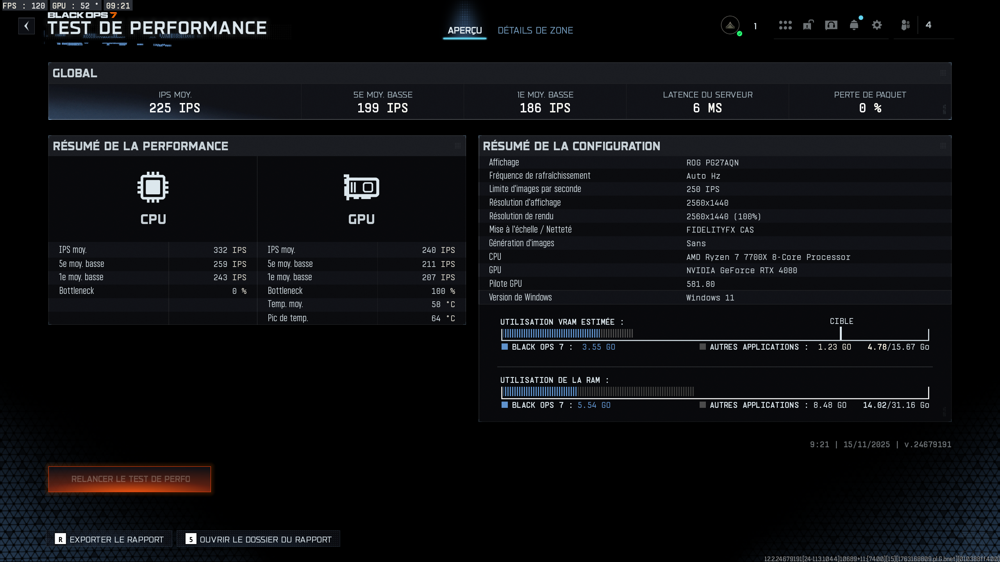
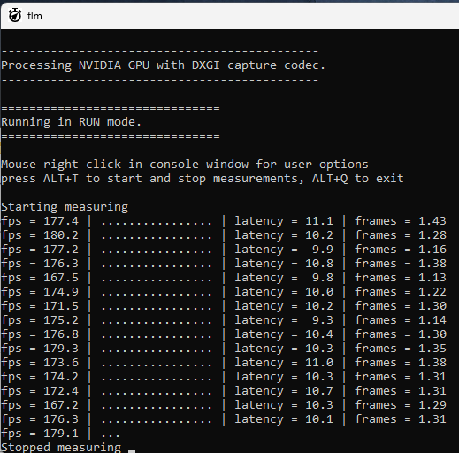

### 2eme test : G-SYNC et V-SYNC 100% Gameplay et Nvidia Reflex "avec"

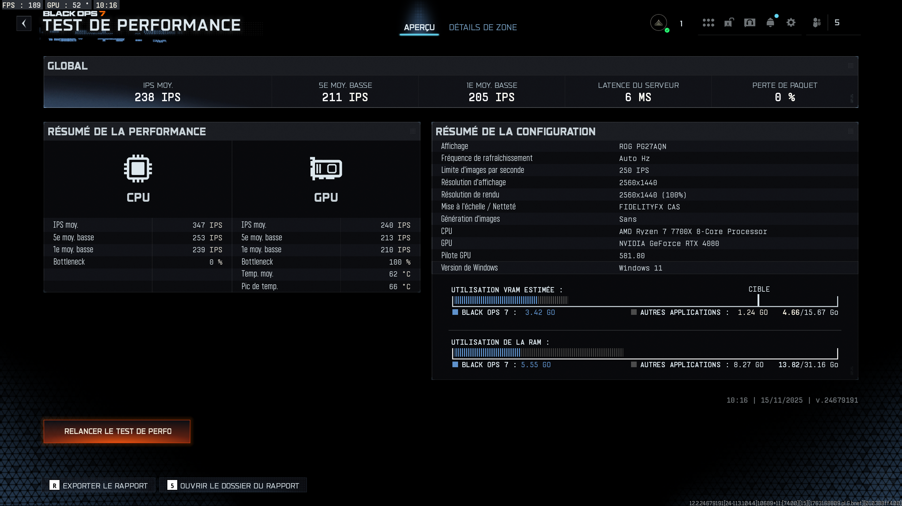
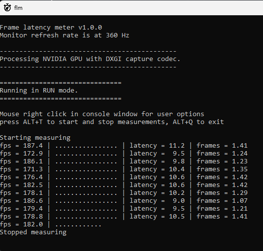

## Mes settings jeu

p.s. je n'ai vu aucune différence de perf entre mode Exclusif et fullscreen sans bordure, je suis resté en sans bordure pour des besoins pratiques.

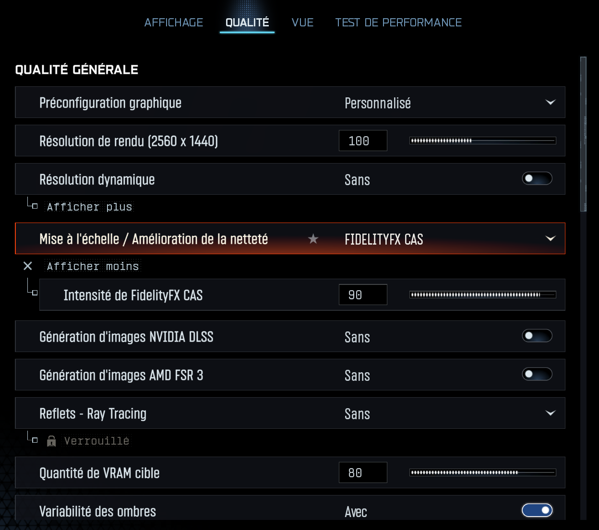
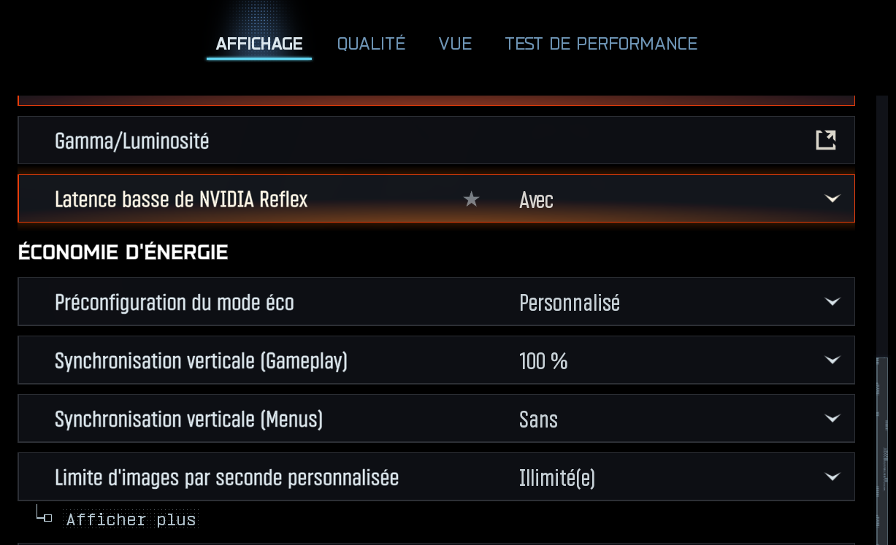
